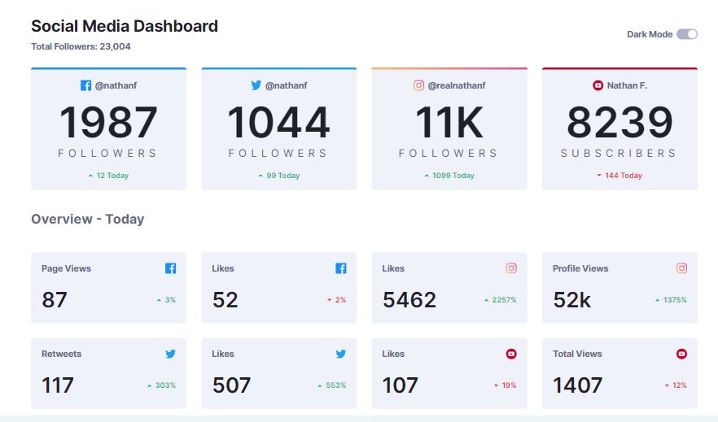

# Frontend Mentor - Social media dashboard with theme switcher solution

This is a solution to the [Social media dashboard with theme switcher challenge on Frontend Mentor](https://www.frontendmentor.io/challenges/social-media-dashboard-with-theme-switcher-6oY8ozp_H). Frontend Mentor challenges help you improve your coding skills by building realistic projects. 

## Table of contents

- [Overview](#overview)
  - [The challenge](#the-challenge)
  - [Screenshot](#screenshot)
  - [Links](#links)
- [My process](#my-process)
  - [Built with](#built-with)
  - [What I learned](#what-i-learned)
  - [Continued development](#continued-development)
  - [Useful resources](#useful-resources)


## Overview

### The challenge

Users should be able to:

- View the optimal layout for the site depending on their device's screen size
- See hover states for all interactive elements on the page
- Toggle color theme to their preference

### Screenshot




### Links

- Live Site URL: (https://social-media-links-dashboard.netlify.app/)

## My process

### Built with

- Semantic HTML5 markup
- CSS custom properties abd variables
- Flexbox
- CSS Grid
- Mobile-first workflow

### What I learned

How to create a simple responsive grid. Learned it from Kevin Powell

```css
.grid {
    display: grid;
    gap: 2rem;
    grid-template-columns: 
        repeat(auto-fit, minmax(min(18rem, 100%), 1fr));
    padding: 10px 0px;
}
```

### Continued development

Need to polish up my:
-CSS grid skills
-Use of breakpoints and before and after pseudo elements
-CSS animations

**Note: Delete this note and the content within this section and replace with your own plans for continued development.**

### Useful resources

- [Disable hover on smaller devices] (https://ben.page/media-hover#:~:text=CSS%20styles%20for%20hovering%20(like,a%20cursor%20that%20can%20hover) - This helped me discover how to deal with hover at smaller breakpoints.

- [CSS gradient borders](https://css-tricks.com/gradient-borders-in-css/) - This is an amazing article which helped me finally understand how to add gradient border on elements like divs.

